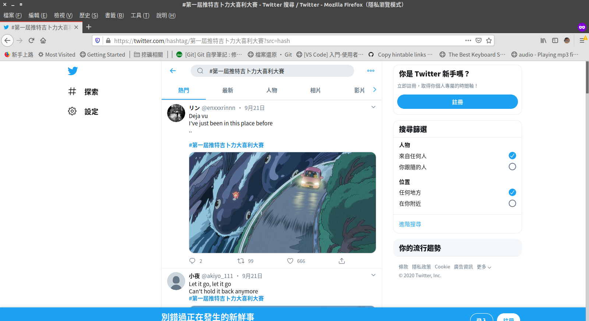
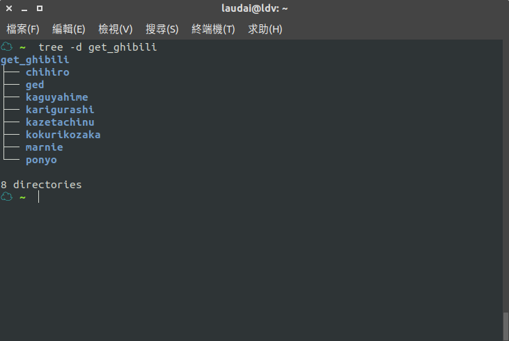
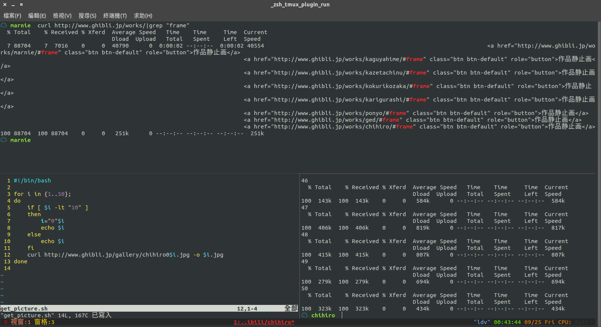

# 起因
吉卜力工作室18日釋出400張劇照，進而導致推特上發起

`#第一屆推特吉卜力大喜利大賽`

為了跟風，想說把照片可以保存下來，但實在懶的一張張下載，所以就寫簡單的script去抓取

# 過程
## 原本
一開始想的太美好，認為用sed、awk、grep、egrep就可以快速寫好script。
卻不知道本身對bash不太熟悉，光是要寫條件式都要查語法，結果看了老半天，還是沒有成功解析出網址內容。[共計花了約兩個小時]

## 後來
後來想說用python寫比較快，確實在資料夾、路徑等等都算是熟悉，但解析網站就卡住了，bs4、lxml、DOM這些沒碰過的東西，光研究如何取得按鈕值就卡了5分鐘，最後想想，主力不在網頁上，還是把時間省下好了。[共計花了約一個小時]

## 最後
冷靜下來仔細想想，我此次主要的目的只是要下載圖片而已，而此網站其實已經將圖片結構化呈獻了。為什麼還要找自己麻煩呢？
所以依循圖片的規則，直接快速寫個簡單的script；完成。[共計花了不到20分鐘]

---
### 目前開放八部作品：

可以使用
`curl http://www.ghibli.jp/works/|grep "frame"`
取得目前已開放下載的作品連結

最後執行結果如下圖
